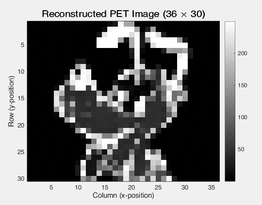

# EECS416 Case Study
# Name: Huy Pham (hbp16)


## (a)

The probability mass function of a Poisson distribution with mean $\lambda$ is:

$$\Pr(X = x) = f(x) = \frac{e^{-\lambda}\lambda^x}{x!}$$

Let $x_i$ be the number of photons emitted from voxel $i$, $i=1,\ldots,n$, and let $y_j$ be the total emissions received by detector pair $j$, $j=1,\ldots,N$. If $C_{ij}$ is the probability that an emission from voxel $i$ reaches detector pair $j$, then the mean number of emissions reaching detector pair $j$, given $x_i$ from each voxel, is:

$$\hat{y}_j = \sum_{i=1}^n C_{ij} x_i = (\mathbf{C}^T \mathbf{x})_j$$

The conditional probability that detector pair $j$ records exactly $y_j$ events is therefore:

$$f(y_j \mid \mathbf{x}) = \frac{e^{-\sum_i C_{ij}x_i} \left(\sum_i C_{ij}x_i\right)^{y_j}}{y_j!}, \qquad j = 1,\ldots,N$$

Since detector pairs observe independently, the joint probability of observing the entire vector $\mathbf{y} = (y_1,\ldots,y_N)^T$ is:

$$f(\mathbf{y} \mid \mathbf{x}) = \prod_{j=1}^{N} f(y_j \mid \mathbf{x}) = \prod_{j=1}^{N} \frac{e^{-\sum_i C_{ij}x_i}\left(\sum_i C_{ij}x_i\right)^{y_j}}{y_j!} \tag{1}$$

To find the maximum likelihood estimate, we take the logarithm of $f(\mathbf{y}\mid\mathbf{x})$ in (1):

$$\log f(\mathbf{y}\mid\mathbf{x}) = \sum_j \left[-\sum_i C_{ij}x_i + y_j \log\!\left(\sum_i C_{ij}x_i\right) - \log(y_j!)\right]$$

The term $-\log(y_j!)$ does not depend on $\mathbf{x}$, so it is dropped as a constant. The first sum simplifies by swapping the order of summation:

$$\sum_j \sum_i C_{ij} x_i = \sum_i x_i \underbrace{\sum_j C_{ij}}_{q_i} = \mathbf{q}^T\mathbf{x}, \qquad \text{where } q_i = \sum_j C_{ij}$$

That is, $\mathbf{q} = \mathbf{C}\,\mathbf{e}_N$ is the vector of row sums of $\mathbf{C}$. Substituting $\hat{y}_j = (\mathbf{C}^T\mathbf{x})_j$ yields the ML objective function:

$$\boxed{f_{ML}(\mathbf{x}) = -\mathbf{q}^T\mathbf{x} + \sum_{j=1}^N y_j \log(\mathbf{C}^T\mathbf{x})_j} \tag{2}$$

The reconstruction problem is:

$$\max_{\mathbf{x} \geq \mathbf{0}} \; f_{ML}(\mathbf{x})$$

---

## (b)

### Gradient Derivation

From (2), we compute $\nabla_x f_{ML}$ by taking the partial derivative with respect to $x_i$ for each $i = 1,\ldots,n$:

$$\frac{\partial f_{ML}}{\partial x_i} = \frac{\partial}{\partial x_i}\left(-\mathbf{q}^T\mathbf{x} + \sum_{j=1}^N y_j \log(\mathbf{C}^T\mathbf{x})_j\right)$$

Since $(\mathbf{C}^T\mathbf{x})_j = \sum_{k=1}^n C_{kj}x_k$:

$$\frac{\partial}{\partial x_i}\left[y_j \log\left(\sum_{k=1}^n C_{kj}x_k\right)\right] = y_j \cdot \frac{C_{ij}}{\sum_{k=1}^n C_{kj}x_k} = \frac{C_{ij}\, y_j}{(\mathbf{C}^T\mathbf{x})_j}$$

Thus, the $i$-th component of the gradient is:

$$\frac{\partial f_{ML}}{\partial x_i} = -q_i + \sum_{j=1}^N \frac{C_{ij}\, y_j}{(\mathbf{C}^T\mathbf{x})_j}$$

To express this in vector form, note that $C_{ij}$ is the $(i,j)$ entry of $\mathbf{C}$, which is the $i$-th element of the $j$-th column vector $\mathbf{C}_j$. Therefore:

$$\nabla_x f_{ML} = -\mathbf{q} + \sum_{j=1}^N \frac{y_j}{(\mathbf{C}^T\mathbf{x})_j}\mathbf{C}_j$$

To convert this sum into matrix form, define the diagonal matrix $\hat{\mathbf{Y}} = \text{diag}(\mathbf{C}^T\mathbf{x})$, so that $\hat{\mathbf{Y}}^{-1} = \text{diag}((\mathbf{C}^T\mathbf{x})_1^{-1}, \ldots, (\mathbf{C}^T\mathbf{x})_N^{-1})$.

Now observe that:

$$\sum_{j=1}^N \frac{y_j}{(\mathbf{C}^T\mathbf{x})_j}\mathbf{C}_j = \sum_{j=1}^N \mathbf{C}_j (\hat{\mathbf{Y}}^{-1})_{jj} y_j = \mathbf{C}\,\hat{\mathbf{Y}}^{-1}\mathbf{y}$$

where we've used the fact that $[\mathbf{C}_1 \;\mathbf{C}_2 \;\cdots\; \mathbf{C}_N] = \mathbf{C}$ and $\hat{\mathbf{Y}}^{-1}\mathbf{y}$ is the vector with components $y_j/(\mathbf{C}^T\mathbf{x})_j$.

Therefore:

$$\boxed{\nabla f_{ML}(\mathbf{x}) = -\mathbf{q} + \mathbf{C}\hat{\mathbf{Y}}^{-1}\mathbf{y}} \tag{3}$$

### Hessian Derivation
From (3):

$$\frac{\partial f_{ML}}{\partial x_i} = -q_i + \sum_{j=1}^N \frac{C_{ij}\, y_j}{\sum_{k=1}^n C_{kj}x_k}$$

Taking the partial derivative with respect to $x_l$, the constant term vanishes:

$$\frac{\partial^2 f_{ML}}{\partial x_l \partial x_i} = \frac{\partial}{\partial x_l}\left(\sum_{j=1}^N \frac{C_{ij}\, y_j}{\sum_{k=1}^n C_{kj}x_k}\right)$$

Using the quotient rule (numerator constant, denominator depends on $x_l$):

$$\frac{\partial}{\partial x_l}\left(\frac{C_{ij}\, y_j}{\sum_{k=1}^n C_{kj}x_k}\right) = C_{ij}\, y_j \cdot \frac{-C_{lj}}{\left(\sum_{k=1}^n C_{kj}x_k\right)^2} = -\frac{C_{ij}\, y_j\, C_{lj}}{\left(\sum_{k=1}^n C_{kj}x_k\right)^2}$$

Summing over $j$:

$$\frac{\partial^2 f_{ML}}{\partial x_l \partial x_i} = -\sum_{j=1}^N \frac{C_{ij}\, y_j\, C_{lj}}{\left(\sum_{k=1}^n C_{kj}x_k\right)^2}$$

In matrix form, the $(i,l)$ entry of the Hessian is:

$$\left[\nabla^2 f_{ML}(\mathbf{x})\right]_{il} = -\sum_{j=1}^N \frac{C_{ij}\, C_{lj}\, y_j}{[(\mathbf{C}^T\mathbf{x})_j]^2}$$

To express this compactly, define $\hat{\mathbf{Y}}^{-2} = \text{diag}([(\mathbf{C}^T\mathbf{x})_1]^{-2}, \ldots, [(\mathbf{C}^T\mathbf{x})_N]^{-2})$ and $\mathbf{Y} = \text{diag}(y_1, \ldots, y_N)$. Then:

$$\left[\nabla^2 f_{ML}\right]_{il} = -\sum_{j=1}^N C_{ij} \cdot (\mathbf{Y}\hat{\mathbf{Y}}^{-2})_{jj} \cdot C_{lj} = -[\mathbf{C}\,\mathbf{Y}\hat{\mathbf{Y}}^{-2}\mathbf{C}^T]_{il}$$

Therefore:

$$\boxed{\nabla^2 f_{ML}(\mathbf{x}) = -\mathbf{C}\,\mathbf{Y}\hat{\mathbf{Y}}^{-2}\mathbf{C}^T}$$

---

## (c)
Consider the specific example with:
- $\mathbf{C} = (\mathbf{I} \mid \mathbf{e}_n)$: an $n \times (2n+1)$ matrix whose first $n$ columns form $\mathbf{I}_n$ and whose last column is $\mathbf{e}_n$ (all ones)
- $\mathbf{y} = \hat{\mathbf{y}} = \mathbf{e}_{2n+1}$ (all ones), so $\mathbf{Y} = \hat{\mathbf{Y}} = \mathbf{I}_{2n+1}$

With $\mathbf{Y} = \hat{\mathbf{Y}} = \mathbf{I}$, the Hessian simplifies to:

$$\nabla^2 f_{ML} = -\mathbf{C}\,\mathbf{I}\cdot\mathbf{I}^{-2}\mathbf{C}^T = -\mathbf{C}\mathbf{C}^T$$

With $\mathbf{C} = [\mathbf{I} \mid \mathbf{e}_n]$:

$$\mathbf{C}\mathbf{C}^T = \mathbf{I}_n\mathbf{I}_n^T + \mathbf{e}_n\mathbf{e}_n^T = \mathbf{I}_n + \mathbf{e}_n\mathbf{e}_n^T$$

Computing each entry $(k,m)$:

$$(\mathbf{C}\mathbf{C}^T)_{k,m} = \begin{cases} 1 + 1 = 2 & \text{if } k = m \\ 0 + 1 = 1 & \text{if } k \neq m \end{cases}$$

So:

$$\nabla^2 f_{ML} = -(\mathbf{I}_n + \mathbf{e}_n\mathbf{e}_n^T) = \begin{pmatrix} -2 & -1 & \cdots & -1 \\ -1 & -2 & \cdots & -1 \\ \vdots & & \ddots & \vdots \\ -1 & -1 & \cdots & -2 \end{pmatrix}$$

Therefore, every entry is nonzero ($-2$ on diagonal, $-1$ off-diagonal), even though $\mathbf{C}$ is sparse.

---

## (d)

### KKT Conditions and the Fixed-Point Algorithm

Since $f_{ML}$ is strictly concave, its maximizer over $\mathbf{x} \geq \mathbf{0}$ is unique and must be the one and only KKT point. The KKT conditions for this non-negativity-constrained maximization problem are:

$$\text{(Gradient)} \qquad \frac{\partial f_{ML}(\mathbf{x})}{\partial x_i} \leq 0 \qquad \text{for each } i = 1,\ldots,n$$

$$\text{(Complementary slackness)} \qquad x_i \frac{\partial f_{ML}(\mathbf{x})}{\partial x_i} = 0 \qquad \text{for each } i = 1,\ldots,n$$

$$\text{(Nonnegativity)} \qquad x_i \geq 0 \qquad \text{for each } i = 1,\ldots,n$$

### Deriving the Fixed-Point Update

At any interior point with $x_i > 0$, the complementary slackness condition requires $\frac{\partial f_{ML}}{\partial x_i} = 0$, giving:

$$-q_i + \sum_{j=1}^N \frac{C_{ij}\, y_j}{\sum_{i'=1}^n C_{i'j}\, x_{i'}} = 0$$

Multiplying both sides by $x_i$ and rearranging:

$$x_i \cdot q_i = x_i \sum_{j=1}^N \frac{C_{ij}\, y_j}{\sum_{i'=1}^n C_{i'j}\, x_{i'}}$$

Recalling that $q_i = \sum_{j=1}^N C_{ij}$, this can be rearranged into the following fixed-point update at iteration $k$:

$$x_i^{(k+1)} = \left(\frac{1}{\sum_{j=1}^N C_{ij}} \sum_{j=1}^N \frac{y_j\, C_{ij}}{\sum_{i'=1}^n C_{i'j}\, x_{i'}^{(k)}}\right) x_i^{(k)}$$

### Fixed-Point Algorithm (Pseudocode)

1. Choose a starting point $\mathbf{x}^{(0)} > \mathbf{0}$ (e.g., $x_i^{(0)} = \sum_j y_j / n$) and set $k = 0$.
2. If $k > 0$, test convergence: if $\|\mathbf{x}^{(k+1)} - \mathbf{x}^{(k)}\| < \varepsilon\left(1 + \|\mathbf{x}^{(k)}\|\right)$ where $\varepsilon = 10^{-6}$, STOP — OPTIMAL.
3. Update: for each $i = 1,\ldots,n$:

$$x_i^{(k+1)} = \left(\frac{1}{\sum_{j=1}^N C_{ij}} \sum_{j=1}^N \frac{y_j\, C_{ij}}{\sum_{i'=1}^n C_{i'j}\, x_{i'}^{(k)}}\right) x_i^{(k)}$$

4. Set $k \leftarrow k+1$ and return to Step 2.

---

### (i): $n=9$, 3×3 Grid, $N=33$ Detector Pairs

Setup: $\mathbf{C} = (\mathbf{B}\;\mathbf{B}\;\mathbf{B})$ where $\mathbf{B}$ is a $9 \times 11$ sparse matrix with $a=0.18$, $b=0.017$:

$$B_{i,i} = a, \quad B_{i,i+1} = b, \quad B_{i,i+2} = a, \qquad i = 1,\ldots,n$$

The observed detector counts are:

$$\mathbf{y}^T = (0,\;0,\;1,\;19,\;27,\;30,\;40,\;50,\;35,\;15,\;1,\;0,\;0,\;1,\;7,\;20,\;38,\;56,\;55,\;38,\;20,\;7,\;1,\;0,\;1,\;3,\;17,\;38,\;40,\;20,\;7,\;1,\;0)$$

Applying the fixed-point algorithm with $\mathbf{x}^{(0)} = (\sum_j y_j / n)\,\mathbf{e}_n$, the algorithm converges and the reconstructed 3×3 emission grid is:

|  | Col 0 | Col 1 | Col 2 |
|---|---|---|---|
| Row 0 | 1.68 | 0.00 | 3.90 |
| Row 1 | 51.30 | 109.66 | 142.70 |
| Row 2 | 128.02 | 67.96 | 14.67 |

Emission activity is concentrated along a diagonal band from bottom-left to middle-right, consistent with the structure of the observed $\mathbf{y}$ vector.

---

### (ii): $n=1080$, 36×30 Grid, $N=2164$ Detector Pairs

Setup: $\mathbf{C} = (\mathbf{B}\;2\mathbf{B})$ where $\mathbf{B}$ is a $1080 \times 1082$ sparse matrix with $a=0.15$, $b=0.05$. The vector $\mathbf{y}$ is loaded from `y-pet.txt`.

Applying the fixed-point algorithm, the solution converges. The first row of the reconstructed 36×30 image (36 values) is:

```
[  1.00   1.00   1.00   1.00   1.00   1.00   1.00   1.00
   1.00   1.00   1.00   1.00   1.00   1.00   1.00  10.00
  24.99 242.98 164.04 159.02   0.93   1.00   1.07   0.97
   0.94   1.04   1.04   0.94   0.98   1.07   1.00   0.93
   1.02   1.06   0.96   0.95 ]
```

Columns 0–14 are near-zero background (~1.0). A sharp peak appears at columns 15–19 (max ≈ 243), indicating the imaged object is concentrated in that region.

---

### (iii): Image Identification

The image is characteristic of a PET brain or organ scan with a localized high-activity region (e.g., a tumor site or metabolically active organ), surrounded by low-activity tissue.



The MATLAB code used to reconstruct the image is below:


%% =========================================================
%  PART (d)(i): n=9, 3x3 grid, N=33 detector pairs
%% =========================================================
fprintf('==============================================\n');
fprintf(' PART (d)(i): n=9, 3x3 grid, N=33\n');
fprintf('==============================================\n\n');
 
n  = 9;
a  = 0.18;
b  = 0.017;
 
B  = build_B(n, a, b);                      % 9 x 11
C1 = [B, B, B];                             % 9 x 33
 
y1 = [0 0 1 19 27 30 40 50 35 15 1 0 0 1 7 20 38 56 55 38 20 7 1 0 1 3 17 38 40 20 7 1 0]';
 
[x1, k1, fval1] = fixed_point_PET(C1, y1);
 
fprintf('Converged in %d iterations\n', k1);
fprintf('Final f_ML value: %.3f\n\n', fval1);
 
% Display as 3x3 grid (reshape column-major)
grid1 = reshape(x1, 3, 3)';
fprintf('Reconstructed 3x3 emission grid:\n');
fprintf('        Col0      Col1      Col2\n');
for r = 1:3
    fprintf('Row%d  %8.2f  %8.2f  %8.2f\n', r-1, grid1(r,1), grid1(r,2), grid1(r,3));
end
fprintf('\n');
 
%% =========================================================
%  PART (d)(ii): n=1080, 36x30 grid, N=2164 detector pairs
%% =========================================================
fprintf('==============================================\n');
fprintf(' PART (d)(ii): n=1080, 36x30 grid, N=2164\n');
fprintf('==============================================\n\n');
 
n  = 1080;
a  = 0.15;
b  = 0.05;
 
B  = build_B(n, a, b);                      % 1080 x 1082
C2 = [B, 2*B];                              % 1080 x 2164
 
% Load y from file (place y-pet.txt in the same directory)
y2 = load('y-pet.txt');                     % 2164 x 1
 
[x2, k2, fval2] = fixed_point_PET(C2, y2);
 
fprintf('Converged in %d iterations\n', k2);
fprintf('Final f_ML value: %.3f\n\n', fval2);
 
% Display first row of the 36x30 reconstructed image
% Image is 30 rows x 36 columns (reshape column-major then transpose)
img = reshape(x2, 36, 30)';                 % 30 x 36
 
fprintf('First row of reconstructed image (36 values):\n');
fprintf('%8.2f', img(1,:));
fprintf('\n\n');
 
%% =========================================================
%  PART (d)(iii): Display reconstructed image
%% =========================================================
 
figure;
imagesc(img);
colormap(gray);
colorbar;
title('Reconstructed PET Image (36 \times 30)', 'FontSize', 14);
xlabel('Column (x-position)');
ylabel('Row (y-position)');
axis image;


%% =========================================================
function [x, k, fval] = fixed_point_PET(C, y, eps)
    if nargin < 3, eps = 1e-6; end
 
    n = size(C, 1);
 
    % --- Starting point: uniform initialization ---
    x = (sum(y) / n) * ones(n, 1);
 
    % --- Precompute q = row sums of C (denominator in update) ---
    q = full(sum(C, 2));   % n x 1
 
    k = 0;
    while true
        % Compute predicted detector counts: yhat = C^T * x  (N x 1)
        yhat = C' * x;                          % N x 1
 
        % Compute the weighted back-projection: C * (y ./ yhat)  (n x 1)
        update_ratio = C * (y ./ yhat);         % n x 1
 
        % Fixed-point update
        x_new = (update_ratio ./ q) .* x;       % n x 1
 
        k = k + 1;
 
        % --- Convergence test ---
        if norm(x_new - x) < eps * (1 + norm(x))
            x = x_new;
            break;
        end
 
        x = x_new;
    end
 
    % --- Compute final f_ML value ---
    yhat = C' * x;
    fval = -q' * x + sum(y .* log(yhat));
end

%% =========================================================
function B = build_B(n, a, b)
    rows = repmat((1:n)', 3, 1);
    cols = [(1:n)'; (2:n+1)'; (3:n+2)'];
    vals = [a*ones(n,1); b*ones(n,1); a*ones(n,1)];
    B = sparse(rows, cols, vals, n, n+2);
end
 

---

## Extra Credits:

Let $Z_{ij}$ be the number of events emitted from voxel $i$ and detected at coincidence line $j$. Since voxel $i$ emits $X_i \sim \text{Poisson}(x_i)$ and each emission reaches detector $j$ independently with probability $C_{ij}$, the Poisson thinning (splitting) property gives:

$$Z_{ij} \sim \text{Poisson}(C_{ij}\, x_i), \qquad \text{all } Z_{ij} \text{ mutually independent}$$

The total counts at detector $j$ are $Y_j = \sum_i Z_{ij}$. By the Poisson superposition property, the sum of independent Poisson variables is Poisson:

$$Y_j = \sum_i Z_{ij} \sim \text{Poisson}\!\left(\sum_i C_{ij}\, x_i\right) = \text{Poisson}(\hat{y}_j)$$

Since emissions from different voxels are independent, the $Y_j$'s are independent across $j$.

Since $Y_j \sim \text{Poisson}(\hat{y}_j)$ independently:

$$P(\mathbf{y} \mid \mathbf{x}) = \prod_{j=1}^N \frac{e^{-\hat{y}_j}\,\hat{y}_j^{y_j}}{y_j!} = \prod_{j=1}^N \frac{e^{-\sum_i C_{ij}x_i}\!\left(\sum_i C_{ij} x_i\right)^{y_j}}{y_j!}$$

---

